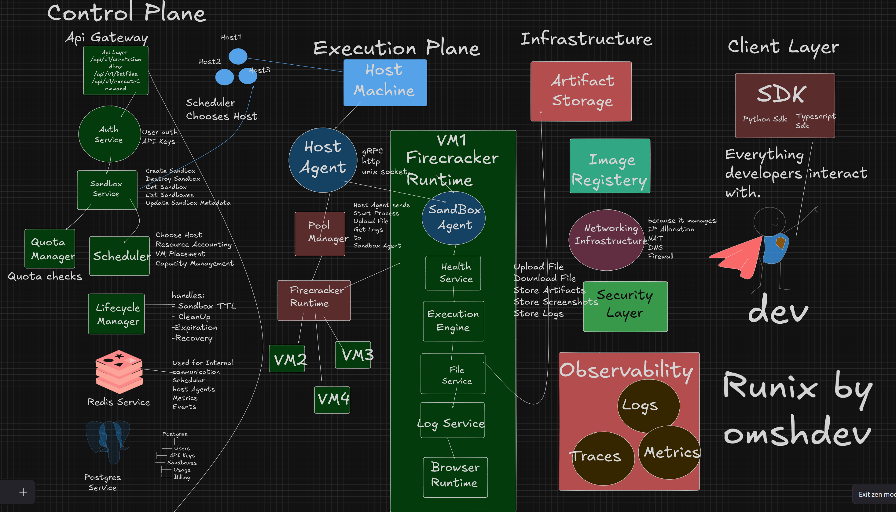

# Runix

# Architecture 
--- 

---

---
Runix is a microVM-powered sandbox platform that provides secure, isolated, and ephemeral runtime environments over an API. Execute code, automate browsers, process files, and power AI agents with disposable compute environments.

**Built with:** Rust • Axum • Tokio • PostgreSQL • Redis • Firecracker • TypeScript SDK
---